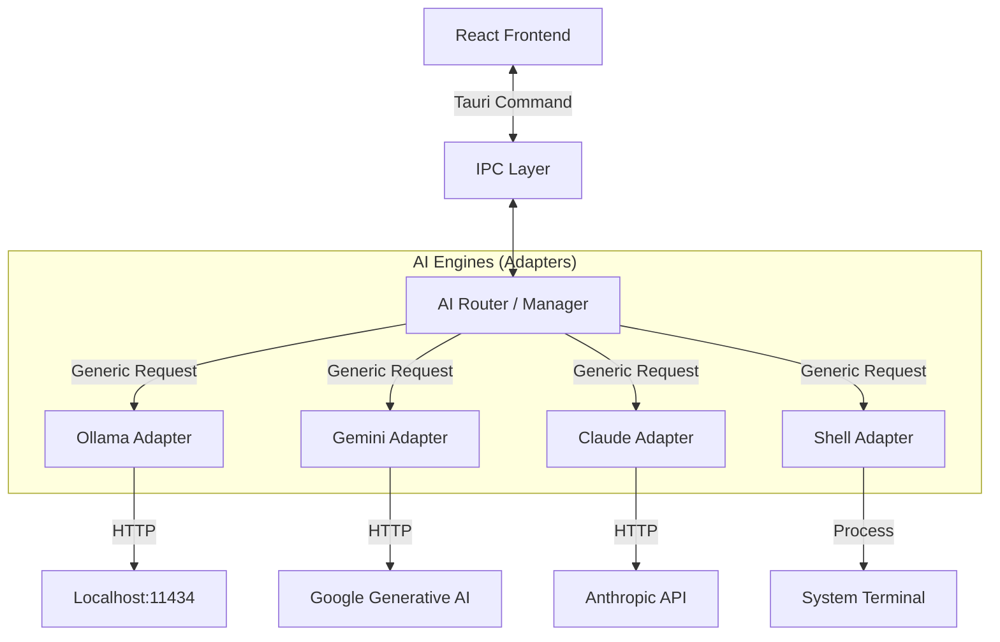

# Architecture V2: Universal AI Companion (Project JARVIS)

## 1. Executive Summary
This architecture document outlines the transformation of "Friday" from a specialized Codex frontend into a **Universal, Hybrid AI Companion**. The goal is to create a personal desktop assistant that is:
- **Engine Agnostic:** Can switch between Claude, Gemini, Ollama (Local), and Shell.
- **Cost Efficient:** Prioritizes free (Gemini Flash) and local (Ollama) tiers.
- **Interactive:** Supports Voice Input/Output (STT/TTS) and "Companion Mode" (overlay UI).
- **Personalized:** Adapts to the user ("Can") via system prompts and memories.

## 2. Core Architecture: The "Adapter Pattern"

The backend (Rust) will no longer tightly couple with `codex app-server`. Instead, it will implement a **Trait-based architecture** where different AI providers are pluggable.

### 2.1. Backend Layers (Rust)



### 2.2. Data Flow
1.  **User Input:** Typed text or Voice (Whisper STT).
2.  **Context Assembly:** Rust reads active file/project context.
3.  **Routing:** `AI Router` selects the active engine (e.g., "Speed Mode" -> Gemini).
4.  **Streaming:** The engine streams chunks of text back to Rust.
5.  **Normalization:** Rust normalizes chunks into a standard format.
6.  **Presentation:** React renders text & TTS Engine speaks it.

## 3. Detailed Components

### 3.1. Rust Backend (`src-tauri/src/ai_core/`)

**The `AIProvider` Trait:**
All engines must implement this interface.

```rust
pub struct AIRequest {
    pub prompt: String,
    pub history: Vec<Message>,
    pub context_files: Vec<FileContext>,
    pub system_prompt: Option<String>,
}

#[async_trait]
pub trait AIProvider: Send + Sync {
    /// Returns the unique ID of the provider (e.g., "gemini_flash")
    fn id(&self) -> String;
    
    /// Streams the response token by token
    async fn stream_completion(&self, request: AIRequest) -> Result<Receiver<String>>;
    
    /// Checks if the provider is available (e.g., checks API key or localhost connection)
    async fn is_available(&self) -> bool;
}
```

### 3.2. Supported Engines

1.  **Ollama (Local/Free):**
    *   **Role:** Offline coding, privacy-focused tasks.
    *   **Integration:** HTTP POST to `http://localhost:11434/api/generate`.
    *   **Models:** `deepseek-coder`, `llama3`, `mistral`.
    *   **Cost:** $0.

2.  **Gemini (Cloud/Free Tier):**
    *   **Role:** General chat, quick analysis, high context window.
    *   **Integration:** Google Generative Language API (REST).
    *   **Models:** `gemini-2.0-flash-exp` (Fastest), `gemini-pro`.
    *   **Cost:** Free tier (rate-limited) or Pay-as-you-go.

3.  **Claude (Cloud/Premium):**
    *   **Role:** Complex architectural tasks, heavy refactoring.
    *   **Integration:** Anthropic API.
    *   **Models:** `claude-3-5-sonnet`.
    *   **Cost:** Paid (API Key required).

4.  **Shell (System):**
    *   **Role:** Executing commands directly.
    *   **Integration:** `std::process::Command`.
    *   **Safety:** Requires explicit user approval for destructive commands.

### 3.3. Frontend (`src/features/companion/`)

**New UI Modes:**
1.  **Standard Mode:** The existing full IDE-like window.
2.  **Companion Mode:** A floating, transparent overlay invoked by `Alt+Space`.
    *   Uses `tauri-plugin-window-state` and `transparent: true`.
    *   Minimalist input bar + response bubble.

**Text-to-Speech (TTS):**
*   Uses `window.speechSynthesis` (Web Speech API) initially for zero latency/cost.
*   Configurable voices (OS native).

## 4. Implementation Plan

### Phase 1: Backend Core (Rust)
- [ ] Add `ai_core` module structure.
- [ ] Implement `AIProvider` trait.
- [ ] Implement `GeminiProvider` (using `reqwest`).
- [ ] Implement `OllamaProvider` (using `reqwest`).
- [ ] Create `AIState` in Tauri to hold the active provider.

### Phase 2: Frontend Wiring
- [ ] Create `useAI` hook in React.
- [ ] Add "Model Switcher" in the Composer UI.
- [ ] Remove hard dependency on `codex app-server` for general chat.

### Phase 3: The "Jarvis" Experience
- [ ] Implement Global Shortcut (`Alt+Space`) using `tauri-plugin-global-shortcut`.
- [ ] Implement TTS (Text-to-Speech) hook.
- [ ] Add "Personality" settings (System Prompt injection).

### Phase 4: Shell & Advanced Tools
- [ ] Allow the AI to construct shell commands.
- [ ] Add an "Execute" button in the chat interface for generated shell scripts.

## 6. MCP, Tasks, Files, GitHub: Logical Roadmap (Ordered)

This roadmap extends the core architecture with MCP, task management, file ops, and GitHub issues.

### Phase 5: MCP Core Integration (Foundation)
- [ ] **MCP Adapter Layer:** Add `mcp_core` module with a provider registry and capability discovery.
- [ ] **Transport:** Support stdio + HTTP transports with reconnect + backoff.
- [ ] **Context Binding:** Enforce `tenant_id`, `workspace_id`, `subject_id` on MCP requests.
- [ ] **Resource Cache:** Cache MCP resource metadata to minimize round trips.

### Phase 6: Task Orchestration (TODO Engine)
- [ ] **Task Model:** Minimal state machine (`queued` → `in_progress` → `done/failed`).
- [ ] **Task Store:** Persist tasks per workspace; link tasks to thread IDs.
- [ ] **UI Mode:** Add "Task Mode" in Composer with explicit task selection.
- [ ] **Events:** Emit task lifecycle events to the frontend hub.

### Phase 7: File Management (Safe Ops)
- [ ] **Allowed Roots:** Explicit allowlist for file read/write roots.
- [ ] **Indexing:** Incremental file index with bounded memory cache.
- [ ] **Diff/Patch Pipeline:** Apply patches with preview + rollback.
- [ ] **Large Files:** Stream reads/writes; avoid loading entire files.

### Phase 8: GitHub Issues Integration (Productivity)
- [ ] **Issue Fetch:** List issues/PRs with pagination + label filters.
- [ ] **Write Ops:** Create issues, add comments, update labels/assignees.
- [ ] **Rate Limit:** Centralized backoff + UI feedback for limits.
- [ ] **Thread Link:** Link issues to threads for context reuse.

### Phase 9: Observability + Policy Gate (Reliability)
- [ ] **Policy Gate:** RBAC/ABAC checks before MCP, file, and GitHub ops.
- [ ] **Audit Log:** Log decisions with `tenant_id` + `decision_id`.
- [ ] **Tracing:** Spans around MCP calls, GitHub ops, file reads/writes.
- [ ] **Metrics:** P50/P95 latency per adapter and task lifecycle step.

### Phase 10: UX Consolidation (Finish)
- [ ] **Mode Selector:** Composer selector for Chat/Task/File/Issue.
- [ ] **Normalization:** Unified thread item format for MCP + GitHub + file ops.
- [ ] **Error UX:** `problem+json` surfaced as structured cards.

## 7. TODO Structure (Task Engine Spec)

```typescript
type TaskStatus = "queued" | "in_progress" | "done" | "failed";

type Task = {
  id: string;
  title: string;
  description?: string;
  status: TaskStatus;
  workspaceId: string;
  threadId?: string;
  createdAt: string;
  updatedAt: string;
};
```

## 8. MCP Adapter Spec (Minimal)

```rust
pub struct McpRequest {
    pub tenant_id: String,
    pub workspace_id: String,
    pub subject_id: String,
    pub server_id: String,
    pub method: String,
    pub params: serde_json::Value,
}

#[async_trait]
pub trait McpProvider: Send + Sync {
    fn id(&self) -> String;
    async fn discover(&self) -> Result<Vec<McpResource>>;
    async fn call(&self, req: McpRequest) -> Result<serde_json::Value>;
}
```

## 9. File Ops Contract (Safety First)

```typescript
type FileOp =
  | { kind: "read"; path: string }
  | { kind: "write"; path: string; content: string }
  | { kind: "patch"; path: string; diff: string };

type FileOpResult = {
  ok: boolean;
  path: string;
  error?: string;
};
```

## 10. GitHub Issues Contract (Minimal)

```typescript
type IssueRef = {
  repo: string;
  number: number;
};

type IssueAction =
  | { kind: "list"; repo: string }
  | { kind: "comment"; issue: IssueRef; body: string }
  | { kind: "label"; issue: IssueRef; labels: string[] };
```

## 5. Security & Privacy
- **Local First:** Default to Ollama if available.
- **Keys:** API Keys stored in OS Keychain (not plain text) or loaded from env.
- **Shell Safety:** Never auto-execute shell commands without confirmation.

---
*Created by: Gemini CLI for Project Friday/Jarvis*
